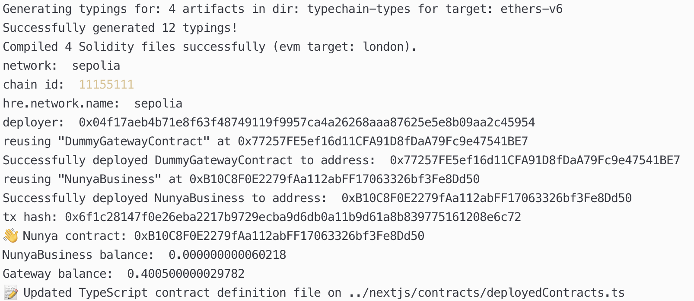

# Demo and Video

TODO - Create a demo or video showcasing your project's functionality. Videos are particularly helpful in conveying the project's value and can be easily shared and understood by judges and the public. Preferably contracts have a usable UI/Mockup to be shown.

## Demos

* Screenshots:

  * Deployment of NunyaBusiness.sol and DummyGateway to Ethereum Sepolia

* Videos:

  * Video of Nunya.business compile, upload, and instantiate a Private Secret Contract to Secret Network Testnet
[YouTube Link](https://youtu.be/pCtQjqqD6gs)
