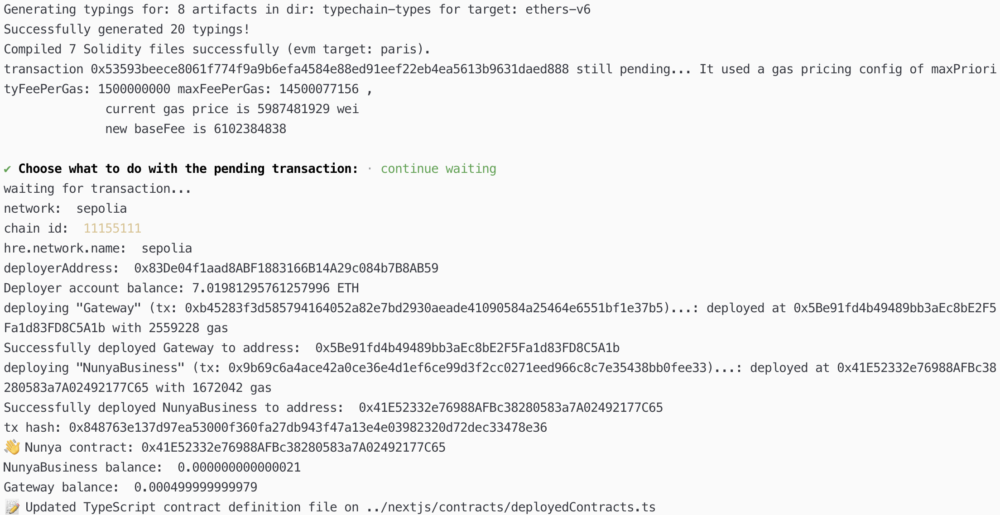

# Demo and Video

> Below are demos and videos showcasing our project's functionality. Videos are particularly helpful in conveying the project's value and can be easily shared and understood by judges and the public. Preferably contracts have a usable UI/Mockup to be shown.

## Screenshots

* Screenshots:

  * Deployment of NunyaBusiness.sol and DummyGateway to Ethereum Sepolia

  * Deployment of NunyaBusiness.sol and Gateway (based on SecretPath) to Ethereum Sepolia using IGateway.sol interface

## Videos

  * Video of Nunya.business compile, upload, and instantiate a Private Secret Contract to Secret Network Testnet
[YouTube Link](https://youtu.be/pCtQjqqD6gs)

  * Video of Nunya.business compile, upload, and instantiate a SecretPath Public Gateway Contract to Sepolia Ethereum Testnet.
[YouTube Link](https://youtu.be/O0unCWsrKA4)
    * It successfully also deploys NunyaBusiness contract since we added `secretContract = IGateway(gateway);` to use an interface based on Gateway.sol instead of the old DummyGatewayContract interface file.
    * Note: The Gateway was deployed with tx: 0x848763e137d97ea53000f360fa27db943f47a13e4e03982320d72dec33478e36 to address 0x41E52332e76988AFBc38280583a7A02492177C65
    * Note: The NunyaContract was deployed with tx:

  * Video of Nunya.business frontend integration [video](./assets/demo.mp4)
