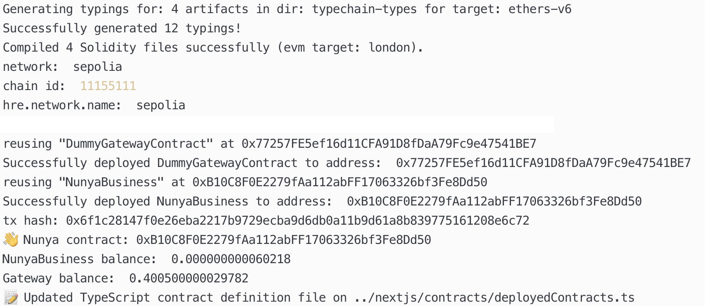
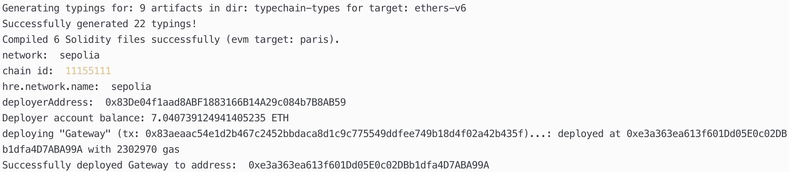

# Demo and Video

TODO - Create a demo or video showcasing your project's functionality. Videos are particularly helpful in conveying the project's value and can be easily shared and understood by judges and the public. Preferably contracts have a usable UI/Mockup to be shown.

## Demos

* Screenshots:

  * Deployment of NunyaBusiness.sol and DummyGateway to Ethereum Sepolia

  * Deployment of Gateway to Ethereum Sepolia

* Videos:

  * Video of Nunya.business compile, upload, and instantiate a Private Secret Contract to Secret Network Testnet
[YouTube Link](https://youtu.be/pCtQjqqD6gs)

  * Video of Nunya.business compile, upload, and instantiate a Public Gateway Contract to Ethereum Sepolia Testnet
[YouTube Link](https://youtu.be/WeBABOnPvgQ)
    * Note: It does not continue to deploy NunyaBusiness contract, likely since we added `secretContract = ISecretContract(gateway);` that still uses the DummyGatewayContract interface file instead of one for the Gateway contract.
    * Note: The Gateway was deployed with tx: 0x83aeaac54e1d2b467c2452bbdaca8d1c9c775549ddfee749b18d4f02a42b435f to address 0xe3a363ea613f601Dd05E0c02DBb1dfa4D7ABA99A
