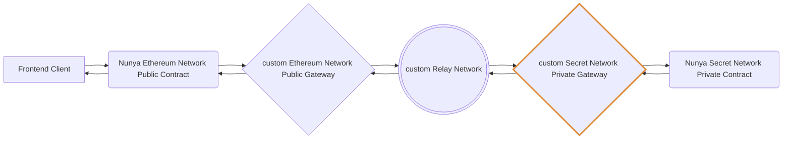
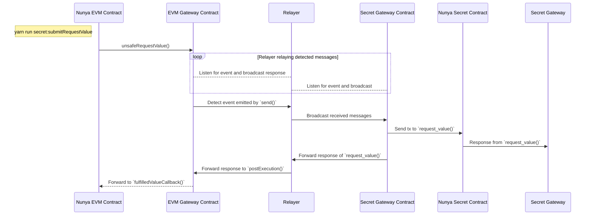
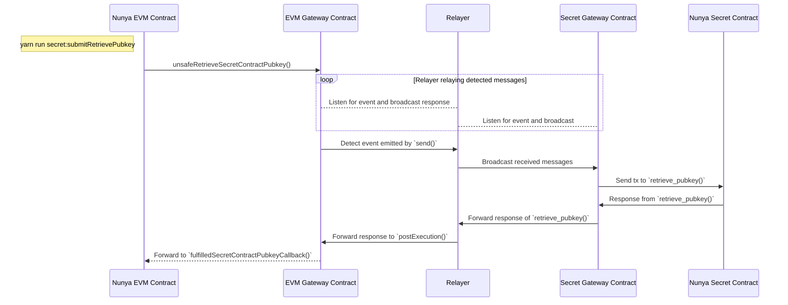

# Setup and Usage

**Table of contents**

* [Introduction](#intro)
* [Usage Guidelines](#usage)
* [Prepare Services](#prepare-services)
* [Run Services](#run-services)
* [Example Interactions](#interact-with-services).
* [WIP - Run Tests](#run-tests)
* [WIP - Run Frontend](#run-frontend)

## Introduction <a id="intro"></a> 

This repository currently allows you to use a script to quickly run the following services and use them to deploy relevant smart contracts to them and observe their outputs in a development environment after configurating environment variables. Further scripts may be run to interact with the smart contracts.

It has only been fully configured to use Local development networks, not Testnets or Mainnet yet. It may work on Testnets, but further modifications may be required to run on Mainnet.

This should make it easy to then customise it for your use case, incorporate tests and deploy it to testnet or mainnet.

### Development Environment

#### Services

* Custom Ethereum Nunya contract [NunyaBusiness.sol](./packages/hardhat/contracts/NunyaBusiness.sol) contract gets deployed on an Ethereum Development Node that is running in a systemd service that is running. Calls to it shall interact with the custom Public Gateway.
* Custom Ethereum Public Gateway contract also gets deployed on an Ethereum Development Node. It was copied from https://github.com/SecretSaturn/SecretPath/blob/main/TNLS-Gateways/public-gateway/src/Gateway.sol and modified. Ideally in future the changes made to it should be transferred to a fork at https://github.com/ltfschoen/SecretPath and used instead
* Custom Relayer uses this fork https://github.com/ltfschoen/SecretPath. It is configured to listens to events emitted by each Gateway and broadcast transactions from the source chain to the destination chain. 
* Custom [Private Secret Gateway contract](./packages/secret-contracts/secret-gateway) gets deployed on Secret Development Network running in a Docker container. It was copied from https://github.com/ltfschoen/SecretPath/tree/main/TNLS-Gateways/secret and modified. It interacts with the Custom Relayer and the Nunya Private contract that gets deployed on on Secret Development Network.
* Custom private Secret [Nunya contract](./packages/secret-contracts/nunya-contract/src/contract.rs) gets deployed on Secret Development Network.



Reference: https://github.com/SecretSaturn/SecretPath/edit/main/TNLS-Gateways/secret/README.md

### Codebase Map

* $PROJECT_ROOT/scripts/run.sh - Script that establishes the Ethereum Development Node service, Secret Development Node service, and Relayer service
* $PROJECT_ROOT/deployed.json - Output after deployment with $PROJECT_ROOT/scripts/run.sh identifying deployed contract information
* $PROJECT_ROOT/packages/hardhat - Ethereum Solidity contracts, deployment configuration, scripts, and deployed ABI artifacts.
  * $PROJECT_ROOT/packages/hardhat/.env.example - Example environment variables for deploying Ethereum Solidity contracts
  * $PROJECT_ROOT/packages/hardhat/hardhat.config.ts - Hardhat configuration used for deploying Ethereum Solidity contracts to different networks
  * NunyaBusiness contract - $PROJECT_ROOT/packages/contracts/NunyaBusiness.sol
  * Custom EVM Gateway contract based on [this](https://github.com/SecretSaturn/SecretPath/blob/main/TNLS-Gateways/public-gateway/src/Gateway.sol) - $PROJECT_ROOT/packages/contracts/Gateway.sol
  * Deployment scripts - $PROJECT_ROOT/packages/hardhat/deploy
  * Deployed contract ABI artifacts - $PROJECT_ROOT/packages/hardhat/artifacts
* $PROJECT_ROOT/packages/nextjs - Frontend based on ScaffoldETH 2
  * $PROJECT_ROOT/packages/nextjs/.env.example - Example environment variables for frontend
  * Homepage - $PROJECT_ROOT/packages/nextjs/app/page.tsx
* $PROJECT_ROOT/packages/relayer/SecretPath/TNLS-Relayers - Git Submodule based on [this](https://github.com/ltfschoen/SecretPath/pull/1) fork of the Relayer with modifications.
  * $PROJECT_ROOT/packages/relayer/SecretPath/TNLS-Relayers/config.yml - Configuration of source and destination networks used by Relayer
  * $PROJECT_ROOT/packages/relayer/SecretPath/TNLS-Relayers/config.yml - Configuration of private keys used to broadcast transactions emited from a source network to a destination network by the Relayer
  * Note: Ignore other subfolders within $PROJECT_ROOT/packages/relayer/SecretPath/ since they are not being used from that Git Submodule
* $PROJECT_ROOT/packages/secret-contracts
  * $PROJECT_ROOT/packages/secret-contracts-scripts/.env.example - Example environment variables to deploy Secret contracts and integrate with Relayer
  * $PROJECT_ROOT/packages/secret-contracts-scripts/src/config/config.ts - configuration file for pre-deployment that uses .env file
  * $PROJECT_ROOT/packages/secret-contracts/nunya-contract - custom private Nunya Secret contract
  * $PROJECT_ROOT/packages/secret-contracts/secret-gateway - custom Secret Network Gateway based on [this](https://github.com/SecretSaturn/SecretPath/tree/main/TNLS-Gateways/secret)
  * $PROJECT_ROOT/packages/secret-contracts-scripts/src/submitRequestValue.ts - custom end-to-end Example script
  * $PROJECT_ROOT/packages/secret-contracts-scripts/src/submitRetrievePubkey.ts - custom end-to-end Example script

### Usage Guidelines <a id="usage"></a>

Start with [Setup Services](#prepare-services).

> MAINTAINERS: If you are a maintainer of this repository, then consider initially following the steps in [_MAINTAINER](./_MAINTAINER.md).

#### Assumptions, Constraints, Exclusions

In this guide it assumes the Ethereum Local Network, Secret Local Network, and Relayer are being run on a local or remote machine running Linux, since macOS may not support SGX.

If necessary, use `scp` to copy file changes that are being made on a local machine across to the remote machine (e.g. `scp -r $SOURCE root@$REMOTE_IP:$DESTINATION`).

In this guide it assumes that you are making changes directly on a local machine or a remote server that supports SGX using `vim` or similar, or otheriwse configuring your code editor like Visual Studio Code to do so.

#### Configure Code Editor

* Setup remote editing if using remote Linux server
	* Install and open Visual Studio Code
	* Install Plugin "Remote Explorer"
	* Remote Explorer
	* Click SSH > + (Note: Replace the IP address below with your own)
		* Enter `ssh root@X.X.X.X`, choose to update /Users/luke/ssh/config
		* Click X.X.X.X > "root" > "Connect in Current Window"
	* Go to Extensions, search for "solidity", and click the apply that extension to "SSH X.X.X.X" for syntax highlighting
	* Use the "Terminal" in Visual Studio code to interact

### Prepare Services <a id="prepare-services"></a>

#### Installation

* Connect to remote server or use local machine if supported (e.g. in the example shown below the Linode server IP address is X.X.X.X)
```bash
ssh root@X.X.X.X
```
* Configure `PROJECT_ROOT` to be the path to the directory where you want to install it.
	```bash
	export PROJECT_ROOT="/root/nunya"
  export USE_NETWORK="localhost" # alternatively "testnet" or "mainnet"
	```
* Clone https://github.com/svub/nunya into `$PROJECT_ROOT`
* Fetch latest from branch 'submit-pubkey'.
	```bash
	BRANCH_NUNYA="submit-pubkey"
	cd $PROJECT_ROOT
	git fetch origin $BRANCH_NUNYA:$BRANCH_NUNYA
	git checkout $BRANCH_NUNYA
	cd $PROJECT_ROOT/packages/secret-contracts/secret-gateway
	git submodule update --init --recursive
	nvm use
	docker stop secretdev && docker rm secretdev
	```

* Initialise Gitsubmodules to include the Relayer and the relevant branch
	```bash
	git submodule update --init --recursive --remote
	```

#### Configure Environment Variables

* Generate the .env files for the Ethereum and Secret contracts, and associated scripts from the .env.example files.
  ```bash
  ETH_CONTRACTS_PATH=$PROJECT_ROOT/packages/hardhat
  cp $ETH_CONTRACTS_PATH/.env.example $ETH_CONTRACTS_PATH/.env

  SCRIPTS_PATH=$PROJECT_ROOT/packages/secret-contracts-scripts
  cp $SCRIPTS_PATH/.env.example $SCRIPTS_PATH/.env

  FRONTEND_PATH=$PROJECT_ROOT/packages/nextjs
  cp $FRONTEND_PATH/.env.example $FRONTEND_PATH/.env
  ```
* Configure the following files:
  * $PROJECT_ROOT/packages/hardhat/.env
    * Add the relevant keys from https://etherscan.io/ and https://account.getblock.io and https://dashboard.alchemy.com/apps.
    * Note that Alchemy does not support Ethereum Sepolia Testnet, so if using testnet then use [Geoblocks](https://getblock.io/) instead to get an API key for Ethereum Sepolia JSON-RPC.
    * Verify the Ethereum network configuration in ./packages/hardhat/hardhat.config.ts
  * $PROJECT_ROOT/packages/secret-contracts-scripts/src/config/config.ts
  * $PROJECT_ROOT/packages/secret-contract-scripts/.env
    * Ensure that in the .env file that `RELAYER_PATH` is set to the path `$PROJECT_ROOT/packages/relayer` if using Gitsubmodules, since that will be the parent directory of ./SecretPath/TNLS-Relayers/config.yml, which includes the configuration file of the relayer on the same machine, because if you run ./scripts/run.sh it will automatically update that relayer config.yml file if the Secret Gateway contract code hash changes in order for it to work.
    * If you want to deploy to Secret Development Network and Ethereum Development Network, then change the value of `USE_ETH_NETWORK` and `USE_SECRET_NETWORK` to both be the same value of `localhost`. Alternatively to use Secret Testnet and Ethereum Sepolia Tesetnet change the value of `USE_ETH_NETWORK` to `sepolia` and change the value of `USE_SECRET_NETWORK` to `testnet`. These environment variable values are used in $PROJECT_ROOT/packages/secret-contracts-scripts/src/config/config.ts under `config.networkSettings.evm.network` and `config.networkSettings.secret.network` to determine what network to deploy the contracts to.
  * $PROJECT_ROOT/packages/nextjs/.env
    * Use the same Alchemy API key. Obtain a WalletConnect project ID at https://cloud.walletconnect.com
    * Verify the contents of ./packages/nextjs/scaffold.config.ts

* Generate the .env file for the Relayer
  ```bash
  RELAYER_PATH=$PROJECT_ROOT/packages/relayer
  cp $RELAYER_PATH/SecretPath/TNLS-Relayers/.env.example $RELAYER_PATH/SecretPath/TNLS-Relayers/.env
  ```
* Configure the following files for the Relayer:
  * $PROJECT_ROOT/packages/relayer/SecretPath/TNLS-Relayers/.env
    * Development
      * Create a new Keplar Wallet that must use Google to generate an associated private key. 
        * Add a value for `secret-private-key` that you obtain from creating a new Keplar Wallet that must use Google to generate an associated private key, that is associated with an address (e.g. secret1glfedwlusunwly7q05umghzwl6nf2vj6wr38fg)
      * Add for Ethereum Development Node the private key into `ethereum-private-key = XXXXX` of the .env file to be the same as that used in $PROJECT_ROOT/packages/secret-contracts-scripts/.env. for `ETH_DEVELOPMENT_PRIVATE_KEY`. IMPORTANT: Exclude the leading `0x`.
    * Testnet
      * Add for Ethereum Sepolia the private key into `ethereum-private-key = XXXXX` of the .env file to be the same as that used in $PROJECT_ROOT/packages/secret-contracts-scripts/.env for `ETH_TESTNET_PRIVATE_KEY`
        * IMPORTANT: Exclude the leading `0x`.
  * $PROJECT_ROOT/packages/relayer/SecretPath/TNLS-Relayers/config.yml
    * Check there is a `chain_id` and `api_endpoint` for both an Ethereum Network and a Secret Network, that should both be for development, testing, or mainnet usage. This should already be pre-configured.

> Warning: Do not rename $PROJECT_ROOT/packages/hardhat/deploy/01_deploy_your_contract.ts to 00_deploy_your_contract.ts or it will only compile but will not deploy.

Continue with [Run Services](#run-services).

### Run Services <a id="run-services"></a>

* Run the following to start the Secret Development Node docker container, the Ethereum Development Node systemd service, and the Relayer systemd service.
	```bash
	export PROJECT_ROOT="/root/nunya"
  export USE_NETWORK="localhost" # alternatively "testnet" or "mainnet"
  cd $PROJECT_ROOT
	$PROJECT_ROOT/scripts/run.sh | tee $PROJECT_ROOT/run.log
	```
	* Note: If you modified your custom Secret Gateway code and the CODE_HASH changes, the script automatically update the `code_hash` of the Relay in the relevant Gitsubmodule to match it.
* Wait. The script outputs "Finished loading" when finished

Continue with [Example Interactions](#interact-with-services).

### Example Interactions <a id="interact-with-services"></a>

The following are examples that interact with the Ethereum and Secret contracts using running services via the relayer.

#### Examples

* Request Value.

```bash
nvm use
yarn run secret:submitRequestValue
```



It interacts with the Ethereum Development Network by calling the custom deployed EVM NunyaBusiness contract that in turn calls the custom deployed EVM Gateway, which emits an event that is picked up by the custom Relayer, which broadcasts a transaction on the Secret Development Network to the custom deployed Secret Gateway contract, which then calls the custom deployed private Nunya Secret contract, and then the target function returns a response that is sent back via same route in reverse that ends up in a callback function in the custom deployed EVM NunyaBusiness contract.


* Retrieve Public Key

```bash
nvm use
yarn run secret:submitRetrievePubkey
```



* TODO: See [_DEV_DEEPDIVE](./DEV_DEEPDIVE.md) and [_SPECIFICATION](./_SPECIFICATION.md) and [_DEMO_AND_VIDEO](./_DEMO_AND_VIDEO.md) and Github Issues for additional features that need to be added.

#### Queries

* Get the Secret Gateway public key (signing verification key '0x' prefixed hex string) and base64 encryption key. Note that the ./scripts/run.sh script already automatically uses a similar script to this to copy and paste the `gatewayContractPublicKey` with `verification_key` and `gatewayContractEncryptionKeyForChaChaPoly1305` with `encryption_key` into $PROJECT_ROOT/packages/secret-contracts-scripts/src/config/config.ts
  ```bash
  yarn run secret:querySecretGatewayPubkey
  ```

#### WIP - Remix

* FIXME - below is outdated and needs to be updated to include interaction with Ethereum Development Network deployment

* Interact with the deployed Gateway EVM contract on Sepolia Ethereum
  * Open Remix https://remix.ethereum.org/
    * Choose "File explorer" tab on the left
    * Choose "Upload Folder" icon
    * Choose the contracts folder $PROJECT_ROOT/packages/hardhat/contracts containing the Solidity files
    * Gateway.sol
      * Open Gateway.sol
        * Click compile icon
      * Choose "Solidity compiler" tab on the left
      * Choose version 0.8.28
      * Click "Compile Gateway.sol" and view the warnings by scrolling down
      * Choose "Deploy and run transactions" tab on the left
      * Click "Environment" and choose "Customize this list..."
        * Select "Sepolia Testnet - Metamask"
      * Click "Sepolia Testnet - Metamask" from the "Environment" drop-down list
      * Allow Metamask to switch to Sepolia network in the popup that appears
      * Open Metamask and click the Remix icon and choose to "Connect more accounts..." to remix.ethereum.org and connect the address associated with the ETH_DEVELOPMENT_ADDRESS used in the .env file
      * Select "Account" to be that ETH_DEVELOPMENT_ADDRESS
      * Enter the deployed Gateway EVM address on Sepolia Testnet (e.g. mentioned in $PROJECT_ROOT/packages/secret-contracts-scripts/src/config/config.ts) and click "At Address"
        * Note: For Ethereum Development Network where a custom Gateway is deployed then we would obtain it from $PROJECT_ROOT/deployed.json after first deploying it.
      * Scroll down to the "Deployed Contracts" section that is autogenerated to interact with the deployed contract
      * Click "secret_gateway_signer_address" to call the Gateway contract getter for that constant and return its value that should be shown as 0x2821E794B01ABF0cE2DA0ca171A1fAc68FaDCa06
    * NunyaBusiness.sol
      * Repeat relevant initial steps above for NunyaBusiness.sol
      * Enter the deployed NunyaBusiness EVM address on Sepolia Testnet (e.g. mentioned in $PROJECT_ROOT/packages/secret-contracts-scripts/src/config/config.ts) and click "At Address"
      * Scroll down to the "Deployed Contracts" section that is autogenerated to interact with the deployed contract
      * Click `setGatewayAddress` to create a transaction after providing the following argument to call the NunyaBusiness contracts transaction using the latest value from $PROJECT_ROOT/packages/secret-contracts-scripts/src/config/config.ts
        * Note: For Ethereum Development Network where a custom Gateway is deployed then we would obtain it from $PROJECT_ROOT/deployed.json after first deploying it.
        * Retrieve its value by clicking to call `CustomGateway`
      * Click `unsafeSetSecretContractInfo` to create a transaction after providing the following arguments `config.networkSettings.secret.testnet.secretNunya.nunyaContractCodeHash` and `config.networkSettings.secret.testnet.secretNunya.nunyaContractAddress` using values from $PROJECT_ROOT/packages/secret-contracts-scripts/src/config/config.ts
        * Note: For Ethereum Development Network where a custom Gateway is deployed then we would obtain it from $PROJECT_ROOT/deployed.json after first deploying it.
        * Retrieve their values by clicking to calls `routing_info` and `routing_code_hash`
      * Click `unsafeRequestValue` to create a transaction after providing the following arguments `0xb6c2b131` and `10000000`
        * If you do not provide a value of at least 2.5 ETH you will get error `Paid Callback Fee Too Low` from the `requestValue` function in the Gateway EVM contract similar to this https://sepolia.etherscan.io/tx/0xdab1b76f3ede8042c850a483a28d73c23a271e5eac37d0e500b55d625fbdbabb. It may be necessary to deploy to local network for debugging.

### Debugging Services <a id="debugging-services"></a>

#### Watch Services Logs

* Watch logs of 
	* Ethereum Local Node. Verify it calls `PostExecution` and the callback function in NunyaBusiness.sol contract.
		```bash
		journalctl -u ethlocal.service -f | tee ~/nunya/ethlocal.service.log
		```
	* Secret Local Node. Optional `docker logs -f --tail 10 secretdev`.
		```bash
		docker logs -f secretdev | tee ~/nunya/secret.service.log
		```
		* Decode the base64 `result` value (e.g. `eyJ...n0=\` from Localsecret logs at https://base64.guru/converter/decode/text
			```bash
			INFO  [enclave_contract_engine::wasm3] debug_print: "msg: PostExecutionMsg {\n    result: \"eyJfcmVxdWVzdF9pZCI6eyJuZXR3b3JrIjoiMzEzMzciLCJ0YXNrX2lkIjoiNCJ9LCJfa2V5IjpbMiwyNTEsMTg4LDE0MywxNjMsMTExLDM0LDE1OCwxNjcsODIsMTE1LDE4OSwyNSwyMzksMTcyLDEyNiw4LDY3LDIzMCwxMzgsNTAsNzcsODEsMTEzLDEyMiwyMDEsNzYsMjE5LDI0Myw1NSwxMzQsMjE0LDg2XSwiX2NvZGUiOjAsIl9udW55YV9idXNpbmVzc19jb250cmFjdF9hZGRyZXNzIjoiMHhBRkZGMzExODIxQzNGM0FGODYzQzcxMDNCQjE3QkRDMUJhMDQ2MDNEIn0=\"
			```
	* Relayer
		```bash
		journalctl -u relayer.service -f | tee ~/nunya/relayer.service.log
		```

#### Troubleshooting

##### Restart Secret Network Development Node

```bash
docker stop secretdev && \
docker rm secretdev && \
sleep 5 && \
cd $PROJECT_ROOT/packages/secret-contracts/secret-gateway && nvm use && make start-server && \
docker logs -f secretdev | tee $PROJECT_ROOT/docker.log
```

##### Restart Ethereum Development Node Service

```bash
systemctl stop ethlocal
systemctl enable ethlocal
systemctl daemon-reload
systemctl start ethlocal
systemctl restart ethlocal
systemctl status ethlocal
journalctl -u ethlocal.service -f
```

### Restart Relayer Service
```
systemctl stop relayer
systemctl enable relayer
systemctl daemon-reload
systemctl start relayer
systemctl restart relayer
systemctl status relayer
journalctl -u relayer.service -f
```

### Check SecretCLI Version and SecretJS Version 

Check use of consistent versions across the codebase (e.g. `v1.15.0-beta.19`).

### Error `TypeError: URL.canParse is not a function`

This means you are likely using the wrong Node.js version, so just change to the project root directory and run `nvm use` in that terminal tab to use the version specified in the .nvmrc file.

### Error `failed to execute message; message index: 0: Execution error: Error during static Wasm validation: Wasm bytecode could not be deserialized. Deserialization error: "Invalid table reference (128)": create contract failed` or `failed to execute message; message index: 0: Execution error: Error during static Wasm validation: Wasm bytecode could not be deserialized. Deserialization error: "I/O Error: UnexpectedEof": create contract failed`

This error may occur if you try to upload the Secret contracts using `make build` instead of the optimised build using `make build-mainnet-reproducible`.

### Unable to upload code to Secret Network using `await secretjs.tx.compute.storeCode`

Check if Beta version of secretjs is necessary incase the Secret Testnet is being upgraded or change to a different version. Update the secretjs dependency in $PROJECT_ROOT/packages/secret-contracts-scripts/package.json to use a version from https://github.com/scrtlabs/secret.js/tags that both uploads and instantiates (e.g. v1.15.0-beta.19) by asking the Secret Network team.

> IMPORTANT: Errors deploying may be because of mismatched types, for example InstantiateMsg here https://github.com/svub/nunya/blob/45e884194e8183229e3d7c61ccba7d789ff996b1/packages/secret-contracts/nunya-contract/src/msg.rs#L16C12-L16C26 must match here https://github.com/svub/nunya/blob/45e884194e8183229e3d7c61ccba7d789ff996b1/packages/secret-contracts-scripts/src/instantiate.ts#L92

### Unable to automatically update the `code_hash` in the config.yml file of the Relayer

If the CODE_HASH changes due to changes in the Secret Gateway codebase, the script ./scripts/run.sh should automatically update update the `code_hash` in the Relayer to match it. If that is not occuring then check whether deployer.json is being updated by the scripts like $PROJECT_ROOT/packages/secret-contracts-scripts/src/uploadAndInstantiateGateway.ts that may have have been run, and inspect the file ./scripts/run.sh or ./scripts/set-relayer.sh that reads the deployer.json file for deployed contract information to check it is updating the Relayer using `yq` correctly. 

### Check latest Python secret-sdk is being used in the Relayer

Check that it is using the latest version of the Python secret-sdk in requirements.txt https://github.com/secretanalytics/secret-sdk-python/releases

### Configuration to Build Secret contracts on macOS (assuming the macOS supports SGX and is not an M1, M2, etc)

> Note: Support in scripts of this repository has only been provided so far for Linux that supports SGX, however tips to help deploy it on other machines that may also support SGX are provided.

To build on macOS it was necessary to run the following first as specified here https://github.com/rust-bitcoin/rust-secp256k1/issues/283#issuecomment-1590391777. Other details https://github.com/briansmith/ring/issues/1824

```bash
/bin/bash -c "$(curl -fsSL https://raw.githubusercontent.com/Homebrew/install/HEAD/install.sh)"
brew install llvm
llvm-config --version
echo "export AR=$(which llvm-ar)" >> ~/.zshrc
echo "export CC=$(which clang)" >> ~/.zshrc
source ~/.zshrc
```

### Unable to debug in production on mainnet

* Note: The default Makefile originally used `--features="debug-print"` but running that gives error `the package secret_gateway depends on secret-cosmwasm-std, with features: debug-print but secret-cosmwasm-std does not have these features.`. The reason why it was removed is mentioned here:
    * https://github.com/CosmWasm/cosmwasm/issues/1841
      * https://github.com/CosmWasm/wasmvm/pull/453
    * https://github.com/CosmWasm/cosmwasm/pull/1667
    * https://github.com/CosmWasm/cosmwasm/pull/1953
  * Solution:
    * https://github.com/CosmWasm/cosmwasm/blob/main/contracts/cyberpunk/tests/integration.rs#L126
  * TODO: For Production on mainnet, configure it to use a debug-print or debug_print with a custom feature flag and wrap use of `set_debug_handler` with it so debug logs aren't output in production.

### WIP - Run Tests <a id="run-tests"></a> 

Run smart contract test with `yarn hardhat:test`

### WIP - Run Frontend <a id="run-frontend"></a>

#### Requirements

Before you begin, you need to install the following tools:

- [Node (>= v18.18)](https://nodejs.org/en/download/)
  - Note: Optionally via NVM
- Yarn ([v1](https://classic.yarnpkg.com/en/docs/install/) or [v2+](https://yarnpkg.com/getting-started/install))
- [Git](https://git-scm.com/downloads)

#### Quickstart

Start the Nunya NextJS app:

```bash
yarn
yarn start
```

Visit app on: `http://localhost:3000` or `http://X.X.X.X:3000` if hosted on a remote server where X.X.X.X is its IP address. You can interact with your smart contract using the `Debug Contracts` page. You can tweak the app config in `packages/nextjs/scaffold.config.ts`.

Further changes:
* Edit smart contracts such as `NunyaBusiness.sol` in `packages/hardhat/contracts`
* Edit frontend homepage at `packages/nextjs/app/page.tsx`. For guidance on [routing](https://nextjs.org/docs/app/building-your-application/routing/defining-routes) and configuring [pages/layouts](https://nextjs.org/docs/app/building-your-application/routing/pages-and-layouts) checkout the Next.js documentation.
* Edit deployment scripts in `packages/hardhat/deploy`
